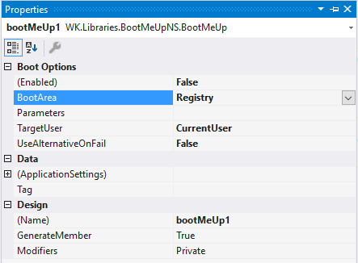
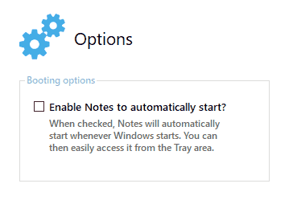
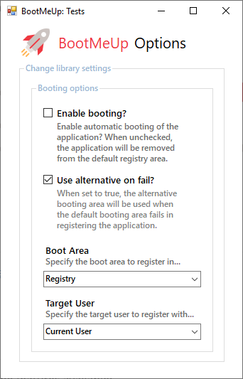

# BootMeUp
[](https://www.nuget.org/packages/BootMeUp/) [](https://www.paypal.com/cgi-bin/webscr?cmd=_s-xclick&hosted_button_id=DJ8D9CE8BWA3J&source=url)

**BootMeUp** is a .NET library that provides automatic startup for .NET applications at system boot while providing additional startup management options.


# Installation 

To install via the [NuGet Package Manager](https://www.nuget.org/packages/BootMeUp/) Console, run:

> `Install-Package BootMeUp`

# Features
Here's a comprehensive list of the features available:

- Built as a component making it accessible in Design Mode.
- Supports [.NET Framework 4.0](https://www.microsoft.com/en-us/download/details.aspx?id=17718) and higher.
- Provides support for the major Windows application startup areas: the *Registry* and the *Startup Folder*.
- Auto-checks whether the application was moved from its original location and updates the registry or shortcut existing appropriately.
- Registering/unregistering your applications from the supported startup areas has been made seamless.
- Provides the ability to register your applications in the *current user* (default) domain or *all users* domain (requires Administrative privileges).
- Uses the alternative method for registering your application if the default fails, giving you 100% confidence when deploying your applications when automatic startup is enabled.
- Includes additional properties and methods to help you manage application startups.

# Usage
### Working in Design Mode
If you prefer working with the Designer, once you've installed the package, go to the Toolbox and locate the library, then simply drag-and-drop the component onto your Main Form.

You can then use the *Properties* window to change its options:



Once you've completed, that's it! BootMeUp will take care of the rest.

If you want to take it a mile further and provide a *checkbox* option that lets your users either enable or disable automatic booting of your application, simply set the library's property `Enabled` to either `true` or `false` respectively:

```c#
// C#: Enable or disable automatic booting.
bootMeUp1.Enabled = checkBox1.Checked;
```

```vb
' VB: Enable or disable automatic booting.
BootMeUp1.Enabled = CheckBox1.Checked
```

Here's an example:



...and the code:

```c#
// C#: Enable or disable my Notes software to auto-start.
bootMeUp1.Enabled = chkEnableNotes.Checked;
```

```vb
' VB: Enable or disable my Notes software to auto-start.
BootMeUp1.Enabled = ChkEnableNotes.Checked
```

To check whether the application is currently set to run on Windows startup, simply use the same `Enabled` property:

```c#
// C#: Check whether my Notes software is set to auto-start.
if (bootMeUp1.Enabled == true)
    // Do something.
else
    // Do something else...
```

```vb
' VB: Check whether my Notes software is set to auto-start.
If BootMeUp1.Enabled = True Then
    ' Do something.
Else
    ' Do something else.
End If
```

By default, the `Enabled` property acts as a setting that checks for you from the available booting areas whether your application has been enabled to boot on Windows startup or not - so no need to have an external setting for this feature.

>  Please note that the recommended `TargetUser` to set is the `CurrentUser` option, both when working with the Registry and Windows *Startup* folder. This is because your application **won't** require any Administrative privileges for the boot setting to be applied in the user's computer. Likewise, this is how the many applications we know and love register for automatic booting. However, if you really need to set it to all users, then simply set the `TargetUser` property to `AllUsers` and make sure you inform users to run as an Administrator when applying your application for automatic booting.

And that's really it for the basics! To read more on the features available, head over to the next section: *Working Programmatically*.

### Working Programmatically

To begin with, once you've installed the library, ensure you import the namespace `WK.Libraries.BootMeUpNS`:

```c#
// C#
using WK.Libraries.BootMeUpNS;
```

```vb
' VB
Imports WK.Libraries.BootMeUpNS
```

You can then add the following code in your startup Form or class:

```c#
// C#
var bootMeUp = new BootMeUp();
            
bootMeUp.UseAlternativeOnFail = true;
bootMeUp.BootArea = BootMeUp.BootAreas.Registry;
bootMeUp.TargetUser = BootMeUp.TargetUsers.CurrentUser;

// Enable auto-booting.
bootMeUp.Enabled = true;

// Or better yet, use a CheckBox.
bootMeUp.Enabled = chkEnabled.Checked;
```

```vb
' VB
Dim bootMeUp As New BootMeUp

bootMeUp.UseAlternativeOnFail = True
bootMeUp.BootArea = BootMeUp.BootAreas.Registry
bootMeUp.TargetUser = BootMeUp.TargetUsers.CurrentUser

' Enable auto-booting.
bootMeUp.Enabled = True

' Or better yet, use a CheckBox.
bootMeUp.Enabled = ChkEnabled.Checked
```

The `BootArea` property provides two options:

1. The `Registry`, which means your application will be added to the *Registry* by default.
2. The `StartupFolder`, which means your application will be added the Windows *Startup* Folder.

The `TargetUser` property likewise provides two options:

1. The `CurrentUser` option, meaning your application will be registered under the `HKEY_CURRENT_USER` registry domain.
2. The `AllUsers` option, meaning your application will be registered under the `HKEY_LOCAL_MACHINE` registry domain.

You can also check if the registration was successful using the property `Successful`:

```c#
// C#
if (bootMeUp.Successful)
    MessageBox.Show("The program will launch on startup.");
else
    MessageBox.Show("There was an issue. Please try launching as Admin.");
```

```vb
' VB
If bootMeUp.Successful = True Then
    MsgBox("The program will launch on startup.")
Else
    MsgBox("There was an issue. Please try launching as Admin.")
End If
```

Let's talk about the property `UseAlternativeOnFail`...

Whenever automatic startup fails to be registered correctly while the property `UseAlternativeOnFail` is set to `true`, BootMeUp moves further by:

1. Trying to register the application once again in the `AllUsers` registry domain if the `CurrentUser` is set as the default in the `TargetUser` property or vice-versa.
2. Creating a shortcut for the application in the *Windows Startup* folder which is often most successful and acts as the last option to be executed if all else fails.

This ensures that your application is eventually set to launch on startup, greatly minimizing on the risks of total failure.

However, if all else really fails, you can be sure that the computer requires some serious privileges to complete this action. This therefore means that you can either inform the user to launch the program as an Administrator, or otherwise display an exception using the inbuilt `Exception` property. 

Here's an example explaining this scenario and how we can go about it:

```c#
// C#
if (bootMeUp.Successful)
    // Success!
else
{
    // We will use the 'AdminMode' property
    // to check whether the program was launched
    // with Administrative privileges.
    if (bootMeUp.AdminMode == false)
    {
        // If the task requires one to run with Admin privileges,
        // direct the user to do so and complete the action.
        MessageBox.Show("Please try launching as Admin...");
    }
    else
    {
        // If true, then there's a serious issue.
        // Display an Exception message to the user.
        // You may also direct the user to a webpage to fix it.
        MessageBox.Show("There was an issue: \n" + bootMeUp.Exception.Message)
    }
}
```

```vb
' VB
If bootMeUp.Successful = True Then
    ' Success!
Else

    ' We will use the 'AdminMode' property
    ' to check whether the program was launched
    ' with Administrative privileges.
    If bootMeUp.AdminMode = False Then

        ' If the task requires one to run with Admin privileges,
        ' direct the user to do so And complete the action.
        MsgBox("Please try launching as Admin...")

    Else

        ' If true, then there's a serious issue.
        ' Display an Exception message to the user.
        ' You may also direct the user to a webpage to fix it.
        MsgBox("There was an issue: \n" + bootMeUp.Exception.Message)
        
    End If

End If
```

As seen, there are two properties at play here:

- The property `AdminMode` lets you check whether your application is currently being run with Administrative privileges.
- The property `Exception` provides error information regarding the failed addition of the program either to the *Registry* or the Windows *Startup* Folder.

The above scenario will help cater for any issues that may be encountered in the process of registering your application for startup. However as indicated before, there are very less likely chances that this may occur as BootMeUp uses a *fail-retry* mode with all its present startup options to ensure that your application is registered to boot once Windows launches.

#### Additional Properties and Methods

##### Properties

- `AdminMode`: As discussed earlier, this property lets you check whether your application is currently being run with Administrative privileges.

- `RunWhenDebugging`: Gets or sets a value indicating whether booting will be enabled or disabled when debugging. This means that when this property is enabled, your application will be registered for startup in your development machine when debugging from Visual Studio. By default, always set it to `false` unless needed.

  > Please note that since this property is set to `false` by default, your application won't be enabled or disabled from booting when run in Visual Studio; however, setting it to `true` means that you can enable or disable booting when running in Visual Studio. The recommended option is to run the application independently if you'd prefer to test the booting feature out.
  >
  > This is especially important for those working with the Designer.

- `ShortcutPath`: Gets the path to the application shortcut created either when the Registry fails or when the default `BootArea` is set to `BootAreas.StartupFolder`.

- `ParentForm`: Gets or sets the component's parent form. This is mainly necessary when the component is used from the Designer.

- `Tag`: Use this property if you wish to add programmer-supplied data associated with the component.

##### Methods

- `Register()`: This method acts as an alternative to the `Enabled` property when set to `true`. It registers an application based on the user-provided settings.
- `Register(TargetUsers targetUser)`: As a variant of the `Register()` method, this method allows you to specify the target user to register with while including other user-provided settings.
- `Unregister()`: This method also acts as an alternative to the `Enabled` property when set to `false`. It unregisters an application based on the user-provided settings.
- `KeyExists()`: Checks whether the application has a startup key created in the System Registry as per the default provided `TargetUser`.
- `KeyExists(TargetUsers targetUser)`: Checks whether the application has a startup key created in the System Registry as per the `targetUser` specified.
- `KeyVaries()`: Checks whether the application has a startup key that varies with its current location in the System Registry as per the default provided `TargetUser`.
- `KeyVaries(TargetUsers targetUser)`: Checks whether the application has a startup key that varies with its current location in the System Registry as per the `targetUser` specified.
- `CreateShortcut()`: Creates a shortcut for the application in the default target user's *Startup* folder.
- `CreateShortcut(TargetUsers targetUser)`: Creates a shortcut for the application in any specified target user's *Startup* folder.
- `DeleteShortcut()`: Deletes any shortcut created for the application in the default target user's *Startup* folder.
- `DeleteShortcut(TargetUsers targetUser)`: Deletes any shortcut created for the application in any specified target user's *Startup* folder.
- `ShortcutExists()`: Checks whether the application has an active shortcut link created in the Windows *Startup* folder.
- `ShortcutVaries()`: Determines whether the available application shortcut points to the current application's location.
- `ShortcutVaries(TargetUsers targetUser)`: Determines whether the available application shortcut points to the current application's location based on a specified target user's *Startup* folder.

### Any Extras?

The sample C# project that comes with the library can give you an preview of the library in action. You can easily interact with the library's settings to see how it works:



Have fun!

*Made with* 😊 *by* [*Willy Kimura*]([https://github.com/Willy-Kimura)